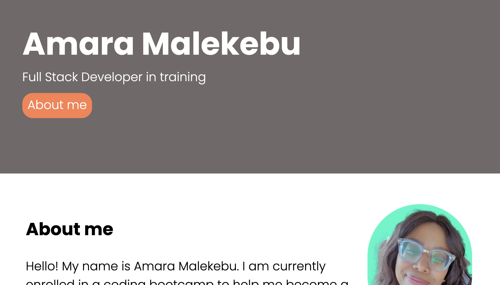

# Challenge-2-Advanced-CSS-Challenge-Professional-Portfolio
​

## Description
​
Hello! Its me Amara, here with my Portfolio.

This is a README.md file for a second challenge of my coding bootcamp.

We were asked to create a webpage that deploys my portfolio. For the purposes of this assignement, this site was created with accessibility standards, links to my first assignment as well as links to my GitHub. Once I have more project completed and ready to be view, i intend to update this file accordingly.

​

## Getting Started

This project has been deployed to GitHub Pages. 

* [GitHub Repository](https://github.com/AmaraMai/Challenge-2-Advanced-CSS-Challenge-Professional-Portfolio)
* [Deployed GitHub](https://amaramai.github.io/Challenge-2-Advanced-CSS-Challenge-Professional-Portfolio/)
* [Demo Video](https://drive.google.com/file/d/19SoMzaJ--VXdyvT_0ke2OvojpYJT02ec/view)

## Screencast of portfolio 

## License
​
MIT License

---
